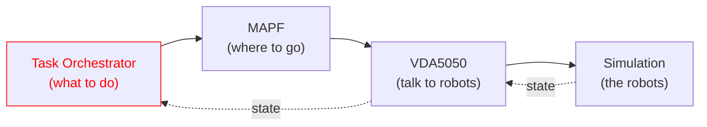
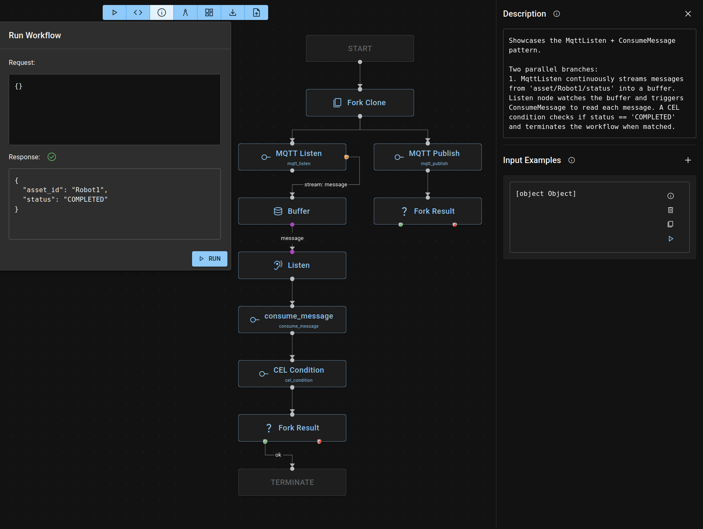

# RMF2 Task Orchestrator

**RMF2 Task Orchestrator** is a workflow executor for multi-robot task coordination, built on top of [Bevy ECS](https://bevy.org/learn/quick-start/getting-started/ecs/) and [OpenRMF's Crossflow](https://github.com/open-rmf/crossflow).


## Within the RMF2 Stack


More information on how Task Orchestrator integrates into the full RMF2 stack [here](https://dev.rmf-industrial.org/latest/guide/architecture.html).

## Getting Started

**Prerequisites:** 
- If running locally: 
  - Install & run MQTT broker (eg.[Mosquitto](https://mosquitto.org/download/))

  - Install & run AMQP server (eg. [RabbitMQ](https://www.rabbitmq.com/docs/download))

- Docker Desktop: [Windows](https://docs.docker.com/desktop/setup/install/windows-install/), [macOS](https://docs.docker.com/desktop/setup/install/mac-install/), [Linux](https://docs.docker.com/desktop/setup/install/linux/)

**Compile & run the Task Orchestrator:**

```bash
cargo run
```

**Run an example workflow:**

```bash
curl -X POST http://localhost:2727/api/executor/run \
  -H 'Content-Type: application/json' \
  -d '{"diagram": '"$(cat diagrams/mqtt_examples/mqtt_listen_consume.json)"', "request": {}}'
```

Alternatively, the workflow can be edited and run on the live editor at <http://localhost:2727>.




## Documentation

- **Platform**: Ubuntu 22.04+
- **Protocol Support**: MQTT, AMQP

Detailed Documentation

- [Task Interfaces](./docs/interfaces.md)

- [Node Types](./docs/nodes.md)

## License

[Apache 2.0](http://www.apache.org/licenses/LICENSE-2.0.html)
