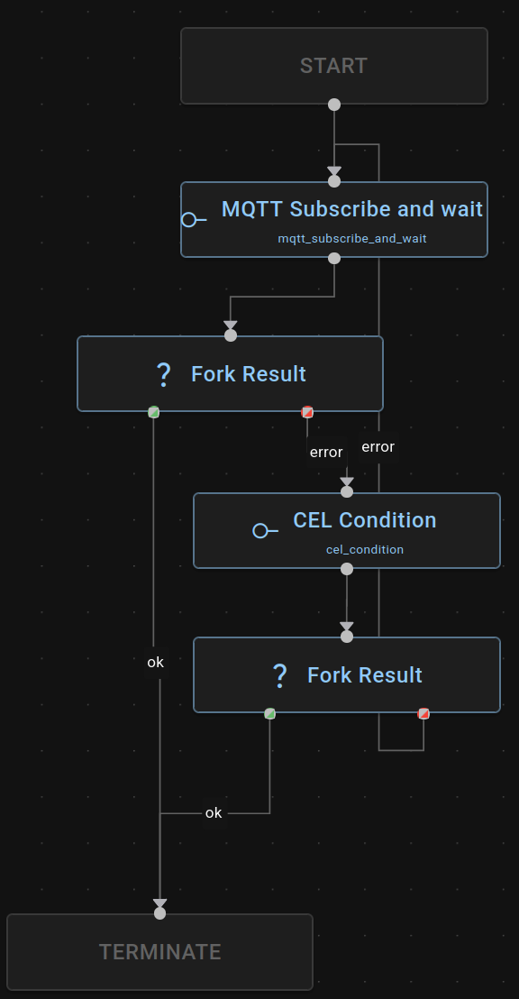
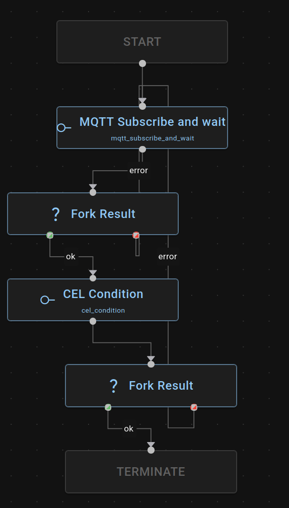

# Node Types

## AMQP Nodes

### GoToNode 
AMQP-based task execution node that publishes `TaskRequest` messages via the `request_response` pattern and waits for `TaskStatus` responses.

### DelayNode
Waits for a configurable duration (default 14s) then publishes a `TaskStatus: COMPLETED` message to the `@RECEIVE@` exchange.

### DefaultNode
A pass-through node that returns `{"status": "ok"}`. Useful as a placeholder or no-op step.

## MQTT Nodes

### mqtt_publish
Publishes a message to an MQTT topic. If no payload is specified in the config, publishes the upstream request.

Config:
```json
{
    "topic": "asset/ManipulatorRobot1/task_request",
    "payload": { "task_type": "Depalletize" },
    "qos": 0,
    "retain": false
}
```

### mqtt_subscribe_and_wait
Subscribes to an MQTT topic and waits for a message matching a [CEL](https://github.com/google/cel-spec) condition, with a configurable timeout. Races the subscription against a timer. If no matching message arrives before the timeout, returns a `Timeout` error.

Config:
```json
{
    "topic": "asset/ManipulatorRobot1/asset_status",
    "condition": "message.state == 'IDLE'",
    "timeout_secs": 30,
    "qos": 0
}
```

### mqtt_listen
Subscribes to an MQTT topic and streams messages continuously into a buffer. Connect the `message` stream output to a buffer for downstream consumption via `listen`/`join`/`buffer_access`.

Config:
```json
{
    "topic": "asset/ManipulatorRobot1/asset_status",
    "qos": 0
}
```

### MqttDeviceReqNode
MQTT-based node for coordinating asset operations. Waits for asset `IDLE` status before publishing a task request and waits for a `COMPLETED` task status response.

MQTT Topics:
- `asset/{asset_id}/asset_status` — Subscribe to check asset is IDLE before sending a request
- `asset/{asset_id}/task_request` — Publish the task request
- `asset/{asset_id}/task_status` — Receive task completion/failure status

The payload follows the same `TaskRequest` format as the generic interface, with device specific `task_params`
```json
{
    "id": "urn:ngsild:Task:task_Depalletize001:TaskRequest",
    "asset_id": "MANIP1",
    "task_type": "Depalletize",
    "task_command": "START",
    "task_params": {
        "area_id": "Outgoing1"
    },
    "timestamp": "2025-01-09T15:30:15Z",
    "task_expected_start": "2025-01-09T14:30:15",
    "task_expected_end": ""
}
```

## Utility Nodes

### cel_condition
Evaluates a [CEL](https://github.com/google/cel-spec) boolean expression against an incoming JSON message. Returns `Ok` if the condition is true, `Err` otherwise. JSON object fields are flattened into the CEL context so they can be accessed directly without the `message.` prefix.

Config:
```jsonc
// For JSON objects, fields are flattened and can be accessed directly
// e.g. {"status": "COMPLETED"} -> status == 'COMPLETED'
// e.g. {"Err":{"Timeout":{"Code": 404}}} -> Err.Timeout.Code == 404
{ "condition": "status == 'COMPLETED' || status == 'FAILED'" }

// For primitives, use the message variable
// e.g. 42 -> message == 42
{ "condition": "message == 42" }

// For arrays, use the message variable with an index
// e.g. [404, 500] -> message[0] == 404
{ "condition": "message[0] == 404" }
```
**cel_condition use example**



### consume_message
Generic consumer node for reading JSON messages from buffers. Used in combination with `listen` operations to process buffered messages downstream.

**consume_message use example**



